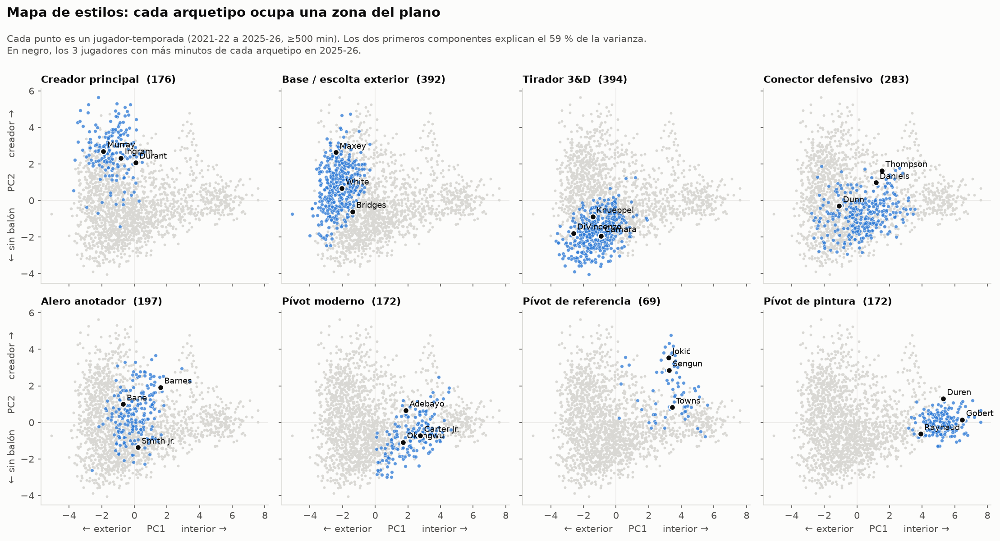
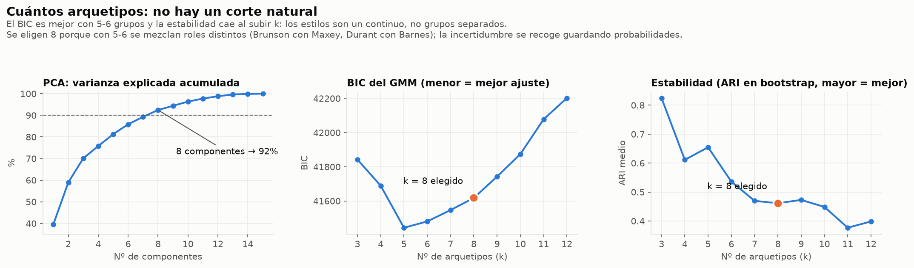
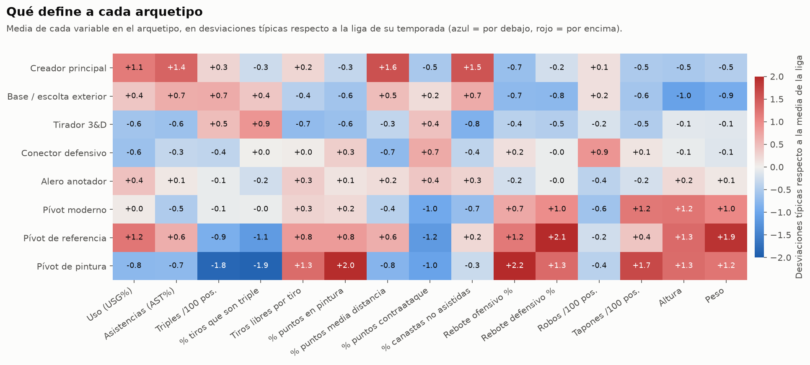
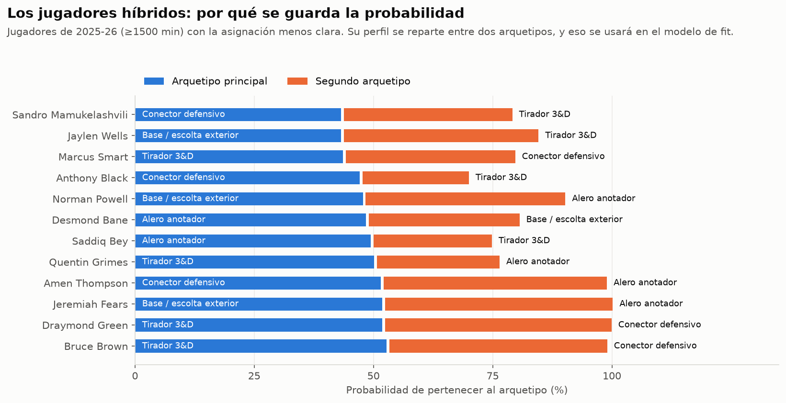
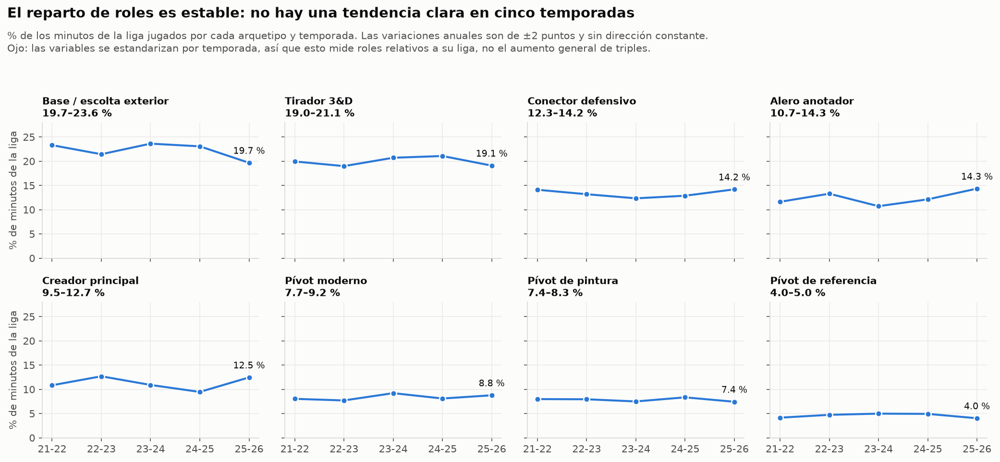

# Bitácora del proyecto

Registro de lo que se va haciendo, las decisiones tomadas y por qué. Lo más reciente, arriba.

---

## 2026-09-22 · Fase 2: arquetipos de jugador

**Objetivo:** agrupar a los jugadores por *rol* (qué hacen en pista) para después poder medir qué rol le falta a una plantilla.

### Qué se ha hecho

- `src/nbafit/features.py`: perfil de estilo de cada jugador-temporada con 15 variables (uso, asistencias, triples, tiros libres, origen de los puntos, % de canastas no asistidas, rebote, robos, tapones, altura, peso).
- `src/nbafit/archetypes.py`: PCA + Gaussian Mixture. Guarda `data/processed/archetypes.parquet` con el arquetipo, su probabilidad y la probabilidad de cada uno de los 8 arquetipos.
- `src/nbafit/viz/archetypes.py`: genera las figuras de esta fase en `reports/figures/`.

```powershell
python -m nbafit.archetypes        # recalcular arquetipos
python -m nbafit.viz.archetypes    # regenerar figuras
```

### Decisiones

| Decisión | Por qué |
|---|---|
| El perfil mide **estilo, no calidad** (sin TS%, ratings…) | Los arquetipos deben agrupar roles, no niveles. La calidad se medirá en las fases de fit y valor. |
| Mínimo **500 minutos** por temporada | Por debajo, las tasas son demasiado ruidosas. Deja 1855 jugador-temporadas (≈370 por temporada). |
| Variables **estandarizadas dentro de cada temporada** | Cada jugador se compara con la liga de su año. Así el aumento general de triples no se confunde con un cambio de rol. |
| PCA con **8 componentes** (92 % de la varianza) | Elimina la redundancia entre variables muy correlacionadas (triples frente a pintura, altura frente a peso). |
| **GMM con 8 arquetipos** | Ver conclusión 2. |
| Se guarda la **probabilidad**, no solo la etiqueta | Ver conclusión 3. |
| El nombre de cada arquetipo se fija por un **jugador ancla** (Jokić, Gobert…) | El número de cluster puede cambiar al recalcular; el ancla no. |

### Conclusiones

**1. Dos ejes explican casi el 60 % del estilo de un jugador:** *interior o exterior* (PC1, 40 %) y *creador o sin balón* (PC2, 19 %).



**2. No hay un número "natural" de arquetipos.** Los estilos forman un continuo, no grupos separados (silueta ≈ 0.1-0.2). El BIC prefiere 5-6 grupos, pero con 5-6 se mezclan roles claramente distintos (Brunson con Maxey, Durant con Barnes). Se eligen 8, que son reconocibles, a cambio de algo de estabilidad.



**3. Los 8 arquetipos:**

| Arquetipo | Rasgos | Ejemplos 2025-26 |
|---|---|---|
| Creador principal | Mucho uso, asistencias, media distancia, tiro propio | Brunson, Durant, Murray, SGA, Luka |
| Base / escolta exterior | Bajitos, triples en volumen, algo de creación | Maxey, White, Curry, Pritchard |
| Tirador 3&D | Poco uso, casi todo triples asistidos | DiVincenzo, Camara, Knueppel |
| Conector defensivo | Robos, contraataque, poco tiro | Dyson Daniels, Amen Thompson, Dunn |
| Alero anotador | Aleros de volumen que penetran y tiran | Banchero, Barnes, Randle, LeBron |
| Pívot moderno | Rebote, tapón, algo de apertura | Mobley, Adebayo, Holmgren, Wembanyama |
| Pívot de referencia | Grandes con mucho uso y rebote dominante | Jokić, Sengun, Towns, Giannis |
| Pívot de pintura | Sin tiro exterior: rebote ofensivo, tapón, continuación | Gobert, Duren, Allen |



**4. Muchos jugadores son híbridos.** El 10 % tiene menos de un 60 % de probabilidad en su arquetipo principal (Draymond Green: 3&D / conector defensivo). En el modelo de fit se usará el reparto de probabilidades, no la etiqueta.



**5. El reparto de roles en la liga es estable** en estas cinco temporadas: oscila ±2 puntos al año sin tendencia clara. Como las variables están estandarizadas por temporada, esto mide roles *relativos a su liga*, no el aumento absoluto de triples.



### Pendiente o a revisar

- Los arquetipos con pocos jugadores (Pívot de referencia, 69) son los menos robustos.
- Jugadores traspasados: su perfil mezcla varios equipos.
- Jóvenes con menos de 500 minutos: no tienen arquetipo todavía. Se tratará con shrinkage hacia la media de su grupo más probable.

---

## 2026-09-22 · Fase 1: ingesta de datos

- Paquete `nbafit` con Python 3.14. Descarga desde stats.nba.com (`nba_api`) de 7 tablas de jugador y 2 de quintetos, para 2021-22 a 2025-26, en Parquet (`data/raw/`).
- Los quintetos se piden equipo a equipo, porque la consulta de toda la liga se corta en 2000 filas. Hay entre 16 000 y 19 500 quintetos por temporada, y los minutos de cada equipo cuadran con una temporada completa.
- Todo se guarda en totales para poder recalcular tasas y ponderar por minutos.
- Descripción de las variables: [variables_jugadores.md](variables_jugadores.md).

## 2026-09-22 · Arranque

- Planteamiento: el fit se medirá como la mejora del net rating predicho de los quintetos al añadir un jugador; el precio, comparando con los jugadores de perfil más parecido.
- Repositorio: https://github.com/pablomedinasw/nba-team-fit
