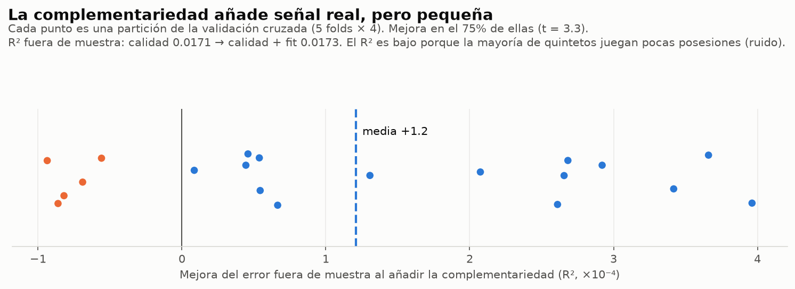
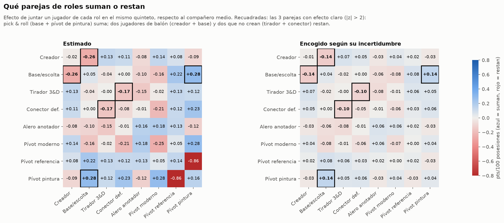
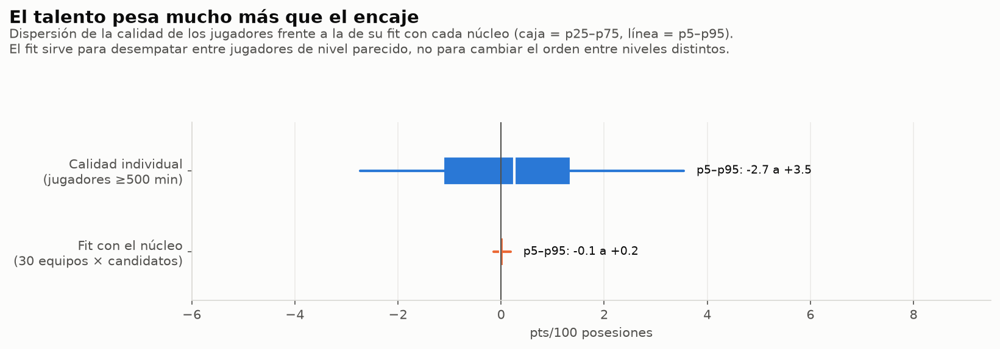
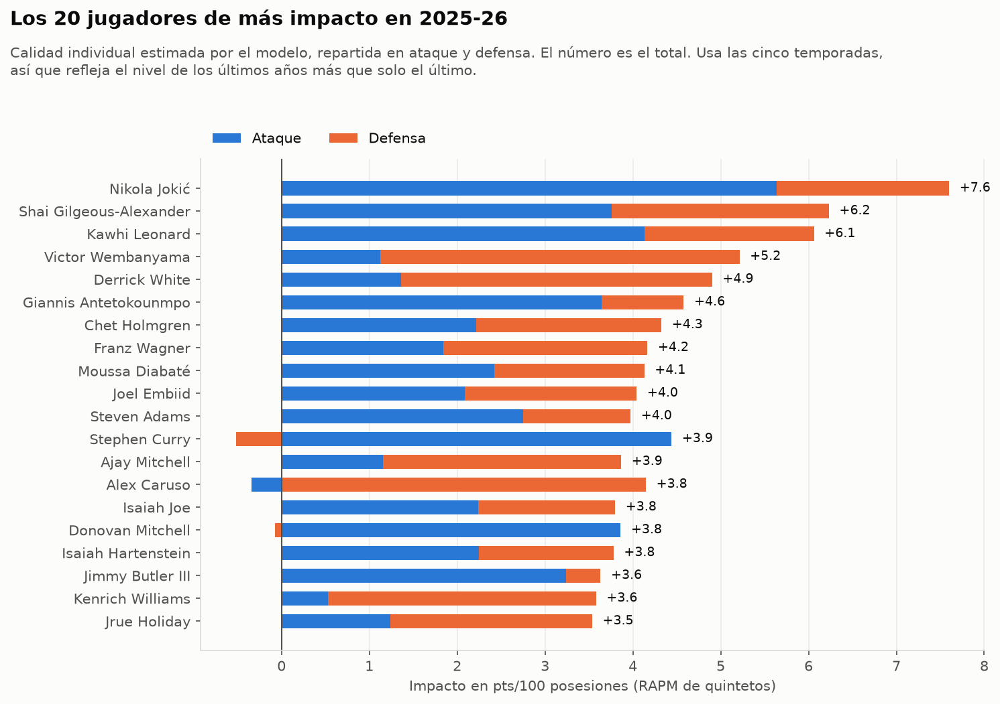

# Bitácora del proyecto

Registro de lo que se va haciendo, las decisiones tomadas y por qué. Lo más reciente, arriba.

---

## 2026-09-22 · Fase 3: modelo de quintetos y fit

**Objetivo:** medir cuánto mejora un quinteto por la *combinación* de sus jugadores (el fit), separándolo de lo buenos que son individualmente, y recomendar el jugador que mejor completa un núcleo.

### Qué se ha hecho

- `src/nbafit/lineups.py`: tabla de quintetos (80 535 quinteto-temporadas, 97,5 % de las posesiones) con el perfil y los arquetipos de sus 5 jugadores. Los jugadores de entre 100 y 500 minutos tienen perfil, pero acercado a la media en proporción a sus minutos (shrinkage).
- `src/nbafit/fit_model.py`: un único modelo ridge, ponderado por posesiones, para el net rating (y el ofensivo y el defensivo por separado):

  `rating del quinteto = calidad de sus 5 jugadores + control de tiempo basura + complementariedad entre arquetipos`

  - **Calidad**: RAPM de quintetos, con un efecto común del jugador a todas las temporadas más una desviación por temporada.
  - **Complementariedad**: interacciones entre pares de arquetipos. Solo cuenta lo **no aditivo**, es decir, lo que el quinteto rinde por encima o por debajo de la suma de sus partes.
  - **Incertidumbre**: bootstrap (50 réplicas) de cada efecto de pareja, y encogimiento hacia 0 según su error (Bayes empírico).
- `src/nbafit/recommend.py`: dado un núcleo de 1 a 4 jugadores (o un equipo), qué rol le encaja y qué jugadores lo completan mejor (calidad + fit).
- `src/nbafit/viz/fit.py`: figuras de esta fase.

```powershell
python -m nbafit.fit_model                           # entrenar, validar y guardar
python -m nbafit.recommend --team DEN                # núcleo = 4 jugadores con más minutos
python -m nbafit.recommend --players "Maxey" "Embiid"
python -m nbafit.viz.fit                             # regenerar figuras
```

### Decisiones

| Decisión | Por qué |
|---|---|
| Ponderar cada quinteto por sus posesiones | La mitad de los quintetos juega 6 posesiones o menos: su net rating es casi todo ruido (±99 con <10 posesiones). |
| Control de tiempo basura (minutos de temporada de los 5) | Sin él, parte de la "complementariedad" era en realidad que los quintetos de suplentes rinden distinto. Con el control, la señal del fit se reduce a la mitad. |
| Calidad = efecto común entre temporadas + desviación por temporada | Con una sola temporada, la calidad de un jugador apenas se parece de un año a otro (correlación 0,3). Compartir entre temporadas sube el R² fuera de muestra de 0,0145 a 0,0171. |
| El fit usa solo **interacciones puras** (matriz doblemente centrada) y solo términos cruzados candidato-núcleo | Como un quinteto siempre suma 5 jugadores, parte de las interacciones es en realidad un efecto lineal por rol, que ya está en la calidad. La primera versión lo contaba dos veces y daba un "bonus fijo por arquetipo" que no dependía del núcleo. |
| Encoger cada efecto de pareja según su incertidumbre | Solo 3 de las 36 parejas son claramente distintas de 0. Sin encoger, el recomendador se fiaría de ruido (por ejemplo, "otro pívot de referencia al lado de Jokić"). |

### Conclusiones

**1. La complementariedad existe, pero la señal es pequeña.** Añadirla mejora la predicción fuera de muestra en el 75 % de las particiones (t = 3,3).



**2. Solo tres parejas de roles tienen un efecto claro:**
- **Base exterior + Pívot de pintura: suma.** Es el pick & roll clásico.
- **Creador principal + Base exterior: resta.** Dos jugadores que necesitan el balón.
- **Tirador 3&D + Conector defensivo: resta.** Dos jugadores que no crean.

El choque aparente entre pívot de referencia y pívot de pintura (−0,86) es el mayor en magnitud, pero no es significativo: hay pocos quintetos así.



**3. El talento pesa mucho más que el encaje.** La calidad individual va de −2,7 a +3,5 pts/100 (p5-p95) y el fit de un candidato con un núcleo de −0,1 a +0,2. El fit sirve para desempatar entre jugadores de nivel parecido.



**4. La calidad individual es creíble.** Jokić (+7,6), SGA, Kawhi, Wembanyama y White encabezan 2025-26, y el modelo separa ataque y defensa: Wembanyama y Caruso destacan por su defensa, y Curry y Mitchell por su ataque.



### Limitaciones y pendiente

- **La calidad casi no cambia entre temporadas** (correlación 0,98), porque la validación cruzada prefiere un jugador casi constante. No capta bien a jóvenes que mejoran ni a veteranos que declinan; convendría añadir una curva de edad.
- **El fit se mide a nivel de arquetipo**: todos los jugadores de un mismo rol encajan igual con un núcleo. Un fit por jugador necesitaría más detalle.
- **Los datos de quintetos agregados no controlan al rival.** Con datos jugada a jugada por tramos (stints) se podría controlar y la señal del fit sería mucho más clara, pero la descarga es mucho mayor.
- Los equipos se toman de la temporada 2025-26: los fichajes del verano de 2026 no están reflejados. Con `--players` se puede definir el núcleo a mano.

---

## 2026-09-22 · Fase 2: arquetipos de jugador

**Objetivo:** agrupar a los jugadores por *rol* (qué hacen en pista) para después poder medir qué rol le falta a una plantilla.

### Qué se ha hecho

- `src/nbafit/features.py`: perfil de estilo de cada jugador-temporada con 15 variables (uso, asistencias, triples, tiros libres, origen de los puntos, % de canastas no asistidas, rebote, robos, tapones, altura, peso).
- `src/nbafit/archetypes.py`: PCA + Gaussian Mixture. Guarda `data/processed/archetypes.parquet` con el arquetipo, su probabilidad y la probabilidad de cada uno de los 8 arquetipos.
- `src/nbafit/viz/archetypes.py`: genera las figuras de esta fase en `reports/figures/`.

```powershell
python -m nbafit.archetypes        # recalcular arquetipos
python -m nbafit.viz.archetypes    # regenerar figuras
```

### Decisiones

| Decisión | Por qué |
|---|---|
| El perfil mide **estilo, no calidad** (sin TS%, ratings…) | Los arquetipos deben agrupar roles, no niveles. La calidad se medirá en las fases de fit y valor. |
| Mínimo **500 minutos** por temporada | Por debajo, las tasas son demasiado ruidosas. Deja 1855 jugador-temporadas (≈370 por temporada). |
| Variables **estandarizadas dentro de cada temporada** | Cada jugador se compara con la liga de su año. Así el aumento general de triples no se confunde con un cambio de rol. |
| PCA con **8 componentes** (92 % de la varianza) | Elimina la redundancia entre variables muy correlacionadas (triples frente a pintura, altura frente a peso). |
| **GMM con 8 arquetipos** | Ver conclusión 2. |
| Se guarda la **probabilidad**, no solo la etiqueta | Ver conclusión 3. |
| El nombre de cada arquetipo se fija por un **jugador ancla** (Jokić, Gobert…) | El número de cluster puede cambiar al recalcular; el ancla no. |

### Conclusiones

**1. Dos ejes explican casi el 60 % del estilo de un jugador:** *interior o exterior* (PC1, 40 %) y *creador o sin balón* (PC2, 19 %).


**2. No hay un número "natural" de arquetipos.** Los estilos forman un continuo, no grupos separados (silueta ≈ 0.1-0.2). El BIC prefiere 5-6 grupos, pero con 5-6 se mezclan roles claramente distintos (Brunson con Maxey, Durant con Barnes). Se eligen 8, que son reconocibles, a cambio de algo de estabilidad.


**3. Los 8 arquetipos:**

| Arquetipo | Rasgos | Ejemplos 2025-26 |
|---|---|---|
| Creador principal | Mucho uso, asistencias, media distancia, tiro propio | Brunson, Durant, Murray, SGA, Luka |
| Base / escolta exterior | Bajitos, triples en volumen, algo de creación | Maxey, White, Curry, Pritchard |
| Tirador 3&D | Poco uso, casi todo triples asistidos | DiVincenzo, Camara, Knueppel |
| Conector defensivo | Robos, contraataque, poco tiro | Dyson Daniels, Amen Thompson, Dunn |
| Alero anotador | Aleros de volumen que penetran y tiran | Banchero, Barnes, Randle, LeBron |
| Pívot moderno | Rebote, tapón, algo de apertura | Mobley, Adebayo, Holmgren, Wembanyama |
| Pívot de referencia | Grandes con mucho uso y rebote dominante | Jokić, Sengun, Towns, Giannis |
| Pívot de pintura | Sin tiro exterior: rebote ofensivo, tapón, continuación | Gobert, Duren, Allen |


**4. Muchos jugadores son híbridos.** El 10 % tiene menos de un 60 % de probabilidad en su arquetipo principal (Draymond Green: 3&D / conector defensivo). En el modelo de fit se usará el reparto de probabilidades, no la etiqueta.


**5. El reparto de roles en la liga es estable** en estas cinco temporadas: oscila ±2 puntos al año sin tendencia clara. Como las variables están estandarizadas por temporada, esto mide roles *relativos a su liga*, no el aumento absoluto de triples.


### Pendiente o a revisar

- Los arquetipos con pocos jugadores (Pívot de referencia, 69) son los menos robustos.
- Jugadores traspasados: su perfil mezcla varios equipos.
- Jóvenes con menos de 500 minutos: no tienen arquetipo todavía. Se tratará con shrinkage hacia la media de su grupo más probable.

---

## 2026-09-22 · Fase 1: ingesta de datos

- Paquete `nbafit` con Python 3.14. Descarga desde stats.nba.com (`nba_api`) de 7 tablas de jugador y 2 de quintetos, para 2021-22 a 2025-26, en Parquet (`data/raw/`).
- Los quintetos se piden equipo a equipo, porque la consulta de toda la liga se corta en 2000 filas. Hay entre 16 000 y 19 500 quintetos por temporada, y los minutos de cada equipo cuadran con una temporada completa.
- Todo se guarda en totales para poder recalcular tasas y ponderar por minutos.
- Descripción de las variables: [variables_jugadores.md](variables_jugadores.md).

## 2026-09-22 · Arranque

- Planteamiento: el fit se medirá como la mejora del net rating predicho de los quintetos al añadir un jugador; el precio, comparando con los jugadores de perfil más parecido.
- Repositorio: https://github.com/pablomedinasw/nba-team-fit
